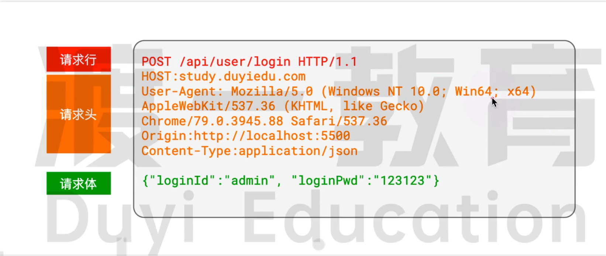
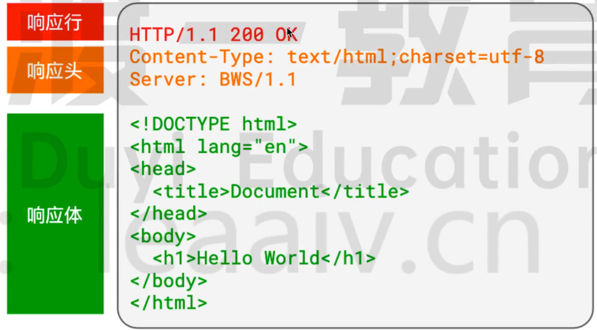

## url

### 端口 Port

它表示客户端希望在哪个应用程序中寻找资源

每个服务器程序，都会监听一个或多个端口，只有找到对应的端口，才能找到这个服务器程序。

**端口号是可选的**，若不填写，则：

- 如果使用的是 http 协议，默认端口号为 80
- 如果使用的是 https 是协议，默认端口号为 443


### 路径 Path

服务器上往往有许许多多的资源，每个资源都有自己的访问路径

**路径是可选的**，若不填写，则路径为 /


### 参数 Query / Param


### hash

在网络通信中，hash 没有什么用，它往往作为浏览器的锚链接出现。


## http

### http 协议规定：

1. 每次 请求 - 响应 都是**独立**的，相互之间互不干扰。这种模式的协议我们称之为**无状态协议**
2. 每次 请求 - 响应 传递的消息都是**纯文本（字符串）**，而且文本格式必须按照 http 协议规定的格式书写。


### 请求的消息格式

请求消息格式有三部分组成



- 请求行：高度概括了客户端想要干什么
- 请求头：描述了请求的一些额外信息
- 请求体：包含了要给服务器传递的正文数据。**请求体是可以省略的**


#### 请求行

请求行是整个 http 报文的第一行字符串，它包含三个部分：请求方法  路径+参数+hash  协议和版本

重点关注**请求方法**

请求方法是一个单词，它表达了客户端的 *动作* ，比如：

- GET：获取
- POST：提交

在 http 协议中，并没有规定只能使用上面两种动作，甚至没有规定每种动作会带来怎样的变化

而在实际的应用中，我们逐渐有了一些约定俗成的规范：

1. 动作通常有：GET（获取资源）、POST（提交消息）、PUT（修改数据）、DELETE（删除数据）。其中，GET 和 POST 最为常见。
2. GET 和 DELETE 请求不能有请求体，而 POST 和 PUT 请求可以有请求体

**浏览器遵循了上面的规范，这带来了 GET 和 POST 的诸多区别**。比如，由于 GET 请求没有请求体，所以要传递数据只能把数据放到 url 的参数中


在浏览器中，获取数据一般使用的都是 GET 请求，比如：

- 在地址栏输入地址并按下回车
- 点击了某个 a 元素
- 获取图片、音频、视频
- 获取 css、js、字体等文件

**事实上，浏览器自动发出的请求基本都是 GET 请求，而 POST 请求需要开发者手动处理，比如在 form 表单中设置 method 为 POST**


#### 请求头 header

请求头是一系列的键值对，里面包含了诸多和业务无关的信息

浏览器每次请求服务器都会自动附带很多的请求头，其实这些请求头大部分服务器是不需要的

> 你可以说不要，但不能说我没给

我们只需关注下面几个请求头即可：

1. Host：url 地址中的主机

2. User-Agent：客户端的信息描述

3. :star: **Content-Type**：请求体的消息是什么格式，如果没有请求体，这个字段无意义

   该字段的常见取值为（**MIME**）：

   - application / x-www-form-urlencoded

     表示请求体的数据格式和 url 地址中参数的格式一样，比如

     ```js
     loginId=admin&loginPwd=123123
     ```

   - **application / json**

     表示请求体的数据是 json 格式，比如

     ```json
     { "loginId": "admin", "loginPwd": "123123" }
     ```

   - **multipart / from-data**

     一种特殊的请求体格式，上传文件一般选择该格式


#### 请求体 body

包含业务数据的字符串

理论上，请求体可以是任意格式的字符串，但习惯上，服务器普遍能识别以下格式：

- application /  x-www-form-urlencoded：`属性名=属性值&属性名=属性值....`
- application / json：`{"属性名": "属性值", "属性名": "属性值",.....}`
- multipart / form-data：使用某个随机字符串作为属性之间的分隔符，通常用于文件上传

由于请求体格式的多样性，服务器在分析请求体时可能无法知晓具体的格式，从而不知道如何解析请求体，因此，服务器往往要求在请求头中附带一个属性`Content-Type`来描述请求体使用的格式

例如：

```js
Content-Type: application / x-www-form-urlencoded
Content-Type: application / json
Content-Type: mutipart / form-data
```


### 响应的消息格式

服务器（通常由后端开发）收到请求的消息后，会运行后端代码对请求进行处理，处理完成后，会给予响应。

服务器的响应格式包含三个部分



#### 响应行

响应行是整个响应字符串的第一行。

响应行包括两个部分：

- 协议版本：表示服务器打算用什么协议和客户端通信
- **状态码、状态消息**：表示服务器对当前请求的表态

状态码分为五类：

| 分类 | 分类描述                                       |
| ---- | ---------------------------------------------- |
| 1**  | 信息，服务器收到请求，需要请求者继续执行操作   |
| 2**  | 成功，操作被成功接收并处理                     |
| 3**  | 重定向，需要进一步的操作以完成请求             |
| 4**  | 客户端错误，请求包含语法错误或无法完成请求     |
| 5**  | 服务器错误，服务器在处理请求的过程中发生了错误 |

通常认为，0~399之间的状态码都是正常的，其他是不正常的


常见的状态码：

1. 200 OK：一切正常

2. 301 Moved Permanently：资源已被永久重定向

   你的请求我收到了，但是呢，你要的东西不在这个地址了，我已经永远的把它移动到了一个新的地址，麻烦你去请求新的地址，地址我放到了响应头的 `Location` 中了

3. 302 Found：资源已被临时重定向

   你的请求我收到了，但是呢，你要的东西不在这个地址了，我临时把它移动到了一个新的地址，麻烦你请求新的地址，地址我放到了响应 头的 `Location` 中了

4. 304 Not Modified：文档内容未被修改

   你的请求我收到了，你要的东西跟之前是一样的，没有任何变化，所以我就不给你结果了，你自己就用以前的吧。啥？你没有缓存以前的内容，关我啥事

5. 400 Bad Request：语义有误，当前请求无法被服务器理解

   你给我发的是个啥啊？我听不懂

6. 401   ：无权限 访问，用户名、密码、令牌错误

7. 403 Forbidden：服务器拒绝执行，访问被禁止

   你的请求我已收到，但是我就是不给你东西

8. 404 Not Found：资源不存在

   你的请求我收到了，但我没有你要的东西

9. 500 Internal Server Error：服务器内部错误

   你的请求我收到了，但这道题我不会，解不出来，先睡了

> 301 和 302 的区别：
>
> 当请求 `a.com`，响应 301，Location：`b.com`，浏览器会将 `a.com --- b.com` 这个对应关系缓存！这样下次我再访问 `a.com` 就会自动给我重定向到 `b.com`，而不会再先请求一遍服务器。
>
> 302 是没有缓存的，因为可能还会变回来。


#### 响应头

和请求头一样，响应头也是由很多个键值对组成，具体有哪些键值对，完全取决于服务器程序

目前，对我们最重要的键值对是 `Content-Type`，它有多种取值，表示响应体的数据类型。

在 B / S 模式中，浏览器会自动根据响应头中的 `Content-Type` 的取值，决定如何处理响应体。

1. `text/plain`：普通的纯文本，浏览器通常会将响应原封不动的显示到页面上
2. `text/html`：html 文档，浏览器通常会将响应体作为页面进行渲染
3. `text/javascript` 或 `application/javascript`：js 代码，浏览器通常会使用JS执行引擎将它解析执行
4. `text/css`：css 代码，浏览器会将它视为样式
5. `image/jpeg`：浏览器会将它视为 jpg 图片
6. `attachment`：附件，浏览器看到这个类型，通常会触发下载功能
7. 其他 `MIME` 类型


#### 响应体

响应的主体内容